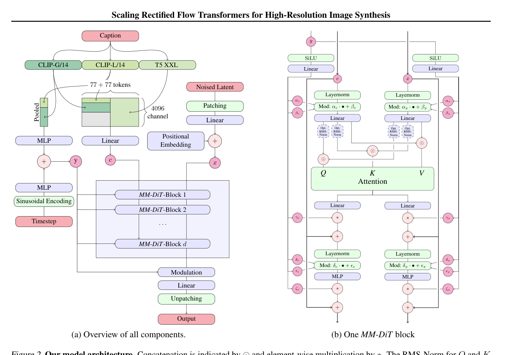

# 06 — Stable Diffusion 3 / MMDiT

本文解释 SD3（*Scaling Rectified Flow Transformers for High-Resolution Image Synthesis*, Esser et al., 2024）的核心创新：**Rectified Flow + MMDiT 双流架构**。

## 1. 两大核心创新

> **SD3 = Rectified Flow 框架 + MMDiT 架构**
> 
> **训练范式**：Rectified Flow（直线插值，比 DDPM 更高效）
> 
> **模型架构**：MMDiT（Multi-Modal Diffusion Transformer，双流 joint attention）

### Rectified Flow 简述

Rectified Flow 定义了一条从噪声到数据的直线路径：

```python
x_t = (1 - t)·x_0 + t·ε      (t 从 1 到 0 的线性插值)
```

模型学习预测速度（矢量场） v_θ，而非噪声 ε_θ：

```python
dx_t/dt = v_θ(x_t, t, c)     (c = 文本条件)
```

相比 DDPM 的曲线路径，rectified flow 的直线路径 **采样步数更少**（28 步而非 50+ 步）。

## 2. MMDiT：双流 Transformer

MMDiT 的核心思想：**文本和图像分别走独立的 Transformer stream**，在 attention 层进行交叉信息交换。

<figure style="margin: 1rem 0 1.5rem;">
  
  <figcaption style="margin-top: 0.6rem; color: #555; font-size: 0.95rem;">
    来源：SD3 论文 Figure 2。右半部分给出了单个 MM-DiT block 的真实结构，和下方的教学版 ASCII 图可以一一对照。
  </figcaption>
</figure>

```
┌─────────────────────────────────────────────────────────────┐
│                      MMDiT Block                            │
│                                                             │
│  Image Stream: [img tokens] ──── AdaLN ──┐                 │
│                                           │                 │
│  Text Stream:  [text tokens] ─── AdaLN ──┤                 │
│                                           │                 │
│                    ┌──────────────────────┘                 │
│                    ▼                                        │
│              Joint Attention                               │
│        (Q from each stream,                                │
│         K/V from concatenated both streams)                │
│                    │                                        │
│         ┌─────────┴─────────┐                              │
│         ▼                   ▼                              │
│   Image FFN + Gate     Text FFN + Gate                     │
│         │                   │                              │
│         ▼                   ▼                              │
│   img tokens (out)     text tokens (out)                   │
└─────────────────────────────────────────────────────────────┘
```

**与 DiT 的差异**：
- DiT：只有一种 token（image patches），文本通过 cross-attention 注入
- MMDiT：两种 tokens 各自有独立的 AdaLN + FFN，attention 时联合处理

### Joint Attention 详解

在 attention 层，Q 分别来自各自的 stream，但 K 和 V 来自拼接后的两个 stream：

```python
# 对 image stream
Q_img = W_q_img · img_tokens
K_joint = concat(W_k_img·img, W_k_text·text)
V_joint = concat(W_v_img·img, W_v_text·text)
attn_img = softmax(Q_img · K_joint^T / sqrt(d)) · V_joint

# 对 text stream（对称）
Q_text = W_q_text · text
attn_text = softmax(Q_text · K_joint^T / sqrt(d)) · V_joint
```

## 3. 文本编码器：三编码器策略

SD3 使用 **三个文字编码器**：

| 编码器 | 输出维度 | 用途 |
|--------|---------|------|
| CLIP-L (ViT-L/14) | 768 (pooled) + 77×768 (seq) | 图文对齐，主要语义 |
| CLIP-G (ViT-bigG/14) | 1280 (pooled) + 77×1280 (seq) | 高质量视觉语义 |
| T5-XXL (4.7B) | 4096 (seq only) | 详细描述理解 |

三个编码器的输出拼接后投影到 MMDiT 的 hidden_size。**关键**：T5-XXL 显存占用很大（>10GB），SD3.5 Medium 可以去掉 T5 以适配 12GB VRAM。

## 4. 推理 Pipeline（SD3 完整流程）

```
1. Prompt → Tokenizer → [CLIP-L + CLIP-G + (T5)]
2. 三个编码器输出拼接 → MMDiT 输入
3. 初始化 latent: x_T ~ N(0, I), shape=(1, 16, H/8, W/8)
4. for t in [1.0, 0.96, ..., 0.0] (28 steps):
     a. CFG: v_cond = MMDiT(x_t, t, text), v_uncond = MMDiT(x_t, t, "")
     b. v_cfg = v_uncond + cfg_scale * (v_cond - v_uncond)
     c. x_{t-dt} = x_t + dt * v_cfg       (Euler step)
5. VAE Decode: (1, 16, H/8, W/8) → (1, 3, H, W)
6. 保存图像
```

## 5. 12GB VRAM 策略

| 策略 | 节省显存 | 代价 |
|------|---------|------|
| 去掉 T5-XXL | ~10 GB → ~0 GB | 文本理解略降 |
| fp16 / bf16 | ~50% | 精度轻微损失 |
| CPU offload | 逐层释放 | 推理变慢（~2-3×） |
| VAE slicing | ~4 GB（decode 阶段） | 分块解码，略慢 |
| Batched CFG | ~1.5 GB | 实现复杂度 |

### 推荐 12GB 配置

```bash
--model stabilityai/stable-diffusion-3.5-medium
--dtype fp16
--enable_model_cpu_offload
--enable_vae_slicing
--no_t5  # 不使用 T5-XXL
```

## 6. Text/Image Token 交互

| 维度 | Image Tokens | Text Tokens |
|------|-------------|-------------|
| 来源 | VAE latent → patchify | Text encoder (CLIP/T5) |
| Shape | (B, N_img, D) | (B, N_text, D) |
| N 典型值 | 1024 (32×32 patches) | 77 (CLIP) 或 ~256 (T5) |
| 位置编码 | 2D sinusoidal | 1D sinusoidal（或无） |
| 流 | 独立 AdaLN + FFN | 独立 AdaLN + FFN |
| 交互 | colspan="2" \| Joint Attention（Q 各自，K/V 共享） |

## 7. CFG 层面说明

SD3 的 CFG 在 **矢量场 (velocity field)** 层面执行，而非噪声或图像层面：

```python
v_cfg = v_uncond + s · (v_cond − v_uncond)
```

其中 s 是 CFG scale（通常 3.0~7.0）。这与 DDPM 框架的 CFG 等价，但因为 rectified flow 学习的是 v_θ 而非 ε_θ，所以公式稍有不同。

CFG 需要 **双重前向传播**（有文本 + 无文本），对 12GB 显存是一个负担。T16/T17 将探索 batched CFG 以节省显存。

## 8. 与 DiT 的递进关系

| 维度 | DiT (2023) | MMDiT / SD3 (2024) |
|------|------------|-------------------|
| 训练框架 | DDPM | Rectified Flow |
| 文本注入 | Cross-attention | 双流 joint attention |
| Position encoding | 2D sinusoidal | 2D sinusoidal |
| AdaLN | AdaLN-Zero | AdaLN（双流各自） |
| 文本编码器 | 单一（CLIP） | 三编码器（CLIP-L + CLIP-G + T5） |
| 采样步数 | ~250（DDPM） | 28（Rectified Flow） |
| 输出维度 | 4ch latent (SD1.x 兼容) | 16ch latent（更高信息密度） |

## 9. MMDiT 双流设计在视频模型中的延续

MMDiT 的双流设计（text stream + image stream 独立 QKV + joint attention）不仅是 SD3 的核心，也在视频 DiT 中被延续：

| 模型 | Denoiser 类型 | Text-Image 交互 | 双流/单流 | Token 数（典型） |
|------|---------------|----------------|----------|------------------|
| SD3 / MMDiT | MMDiT（图像） | Joint Attention（双流） | 双流 | ~4250 |
| FLUX | Single-Stream DiT | Concat + Unified ATTN | 单流 | ~4429 |
| Wan2.1 | Video DiT | Cross-Attention | 单流 | ~32,760 |
| HunyuanVideo | Dual-Stream Video DiT | Joint Attention（双流） | 双流（MMDiT 延伸） | ~118,800 |
| CogVideoX | Expert Transformer | Cross-Attention (causal) | 单流 | ~17,550 |
| LTX-Video | Compact DiT | Cross-Attention | 单流 | ~1,320 |

**观察**：HunyuanVideo 是唯一明确延续 MMDiT 双流设计的视频模型（text stream + image stream 独立 AdaLN + joint attention）。其他视频模型选择了更简单的单流 + cross-attention 方案——对于 12GB 场景，单流意味着更少的参数和更简单的推理路径。

**12GB 场景下的"双流 vs 单流"选择**：双流（如 HunyuanVideo）虽然 text-image 交互更精细，但双倍的 QKV 和 AdaLN 参数也意味着更大的 DiT 权重。当 HunyuanVideo 的 8.3B DiT 权重本身就超 12GB 时（fp16 ~16.6GB），双流的"质量优势"在 12GB 约束下没有实现空间。这也是为什么 CogVideoX-2B（单流）和 LTX-Video 2B（单流）更受 12GB 用户青睐。

## 本页结论

SD3 将 rectified flow（训练框架）和 MMDiT（模型架构）结合，用双流 joint attention 让文本和图像 tokens 在所有层交互。相比 DiT，采样步数大幅减少（250→28），文本理解和图像质量均有提升。但三编码器（尤其是 T5-XXL）带来的显存压力需要在 12GB VRAM 下通过去 T5、offload、slicing 等策略缓解。在视频 DiT 中，双流 MMDiT 设计被 HunyuanVideo 延续但被大多数 12GB 友好视频模型放弃（选择更轻的单流方案）。

## 和我的 diffusion_engine 的关系

`diffusion_engine/core/attention.py` 中的 `JointAttention` 是 MMDiT joint attention 的 **toy 简化版**。真实 SD3 MMDiT 是双流架构（各自有 AdaLN + FFN），我们的 toy 实现简化为：拼接 → unified attention → 拆分。这是一个概念验证，不追求与 SD3 实现一致。T12 的 text conditioning 模块将提供接近真实 pipeline 的接口。
