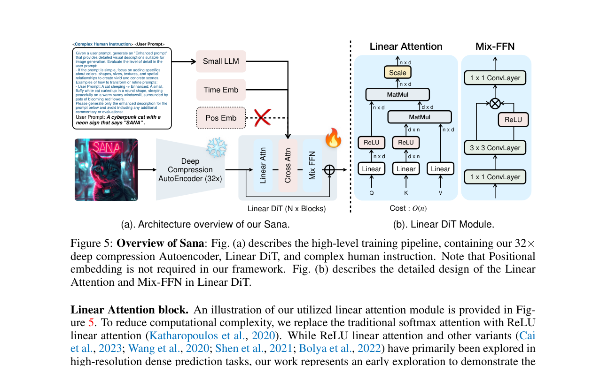

# 08 · Sana 高效高分辨率生成

本文解释 Sana 如何通过三个激进设计（LLM text encoder、linear attention、SVDQuant 量化）把 DiT 推向高效率极限，实现 12GB 消费级 GPU 上的高分辨率（甚至 4K）文生图。

## 1. 高效高分辨率问题的本质

### 高分辨率下的显存噩梦

扩散模型在高分辨率下的显存压力来自三个层面：

| 瓶颈 | 1024×1024 | 2048×2048 | 4096×4096 | 增长规律 |
|------|-----------|-----------|-----------|----------|
| Image Tokens（p=2） | 4,096 | 16,384 | 65,536 | O(HW) |
| Full Attention 矩阵（fp16） | ~33 MB | ~536 MB | ~8.6 GB | **O(n²) = O(H²W²)** |
| Text Encoder VRAM（T5-XXL） | ~5 GB | ~5 GB | ~5 GB | O(1) — 但已经很大 |
| VAE Decoder 输出 | ~12 MB | ~48 MB | ~192 MB | O(HW) |

> **核心问题**：Full Attention 的 O(H²W²) 增长是高分辨率推理的绝对瓶颈。在 4096px 下，仅一层 attention 的中间矩阵就需要 8.6 GB（fp16），超过大部分消费级 GPU 的总显存。这就要求要么降低分辨率，要么改变 attention 的计算方式。

## 2. Sana 的三个激进设计

<figure style="margin: 1rem 0 1.5rem;">
  
  <figcaption style="margin-top: 0.6rem; color: #555; font-size: 0.95rem;">
    来源：Sana 论文 Figure 5。图中同时把 Gemma 小 LLM、32× deep compression autoencoder、Linear DiT 和 Mix-FFN 的组合关系画清楚了。
  </figcaption>
</figure>

### 设计 1：LLM as Text Encoder（用 Gemma-2B 替代 CLIP+T5）

| 对比 | SD3 / FLUX | Sana |
|------|-----------|------|
| Text Encoder | CLIP-L + CLIP-G + T5-XXL（总计 ~13B） | **Gemma-2B**（仅 2B） |
| Encoder VRAM | ~16 GB（三个全载） | **~4 GB** |
| Hidden Dim | 768 + 1280 + 4096 | **2304**（Gemma hidden dim） |
| Text-Image 交互 | Joint Attention / Concat | **Cross-Attention** |

**为什么小 LLM 更好**：LLM（Gemma-2B）的语言理解能力远强于 CLIP（后者只能做图文匹配）。2B 的小 LLM 比 11B 的 T5-XXL 小 5×，但文本理解不输。Sana 用 cross-attention（text tokens 作为 K/V，image tokens 作为 Q）注入文本条件，而非 MMDiT 的 joint attention。这意味着 text tokens 不参与自注意力——进一步降低注意力复杂度。

### 设计 2：Linear Attention（O(n) 替代 O(n²)）

**O(n²) Softmax Attention 的问题**：

```python
# 标准 softmax attention
A = softmax(Q · K^T / √d) · V    # Q,K 都是 n×d
# 中间矩阵 QK^T 是 n×n → O(n²) 内存

# 对 4096px 图像：n = 65536
# QK^T = 65536 × 65536 × 2 bytes (fp16) ≈ 8.6 GB ❌
```

**Linear Attention 的原理**：

```python
# Linear attention（kernel trick）
φ = ReLU  # 或 ELU+1, cos, 等非线性核

# 先算 K^T·V：d×d 矩阵，与 n 无关！
KV = φ(K)^T · V         # shape: (d, d) ← 关键：不依赖 n
A  = φ(Q) · KV          # shape: (n, d)

# 中间矩阵 KV 是 d×d
# 对任意分辨率：KV = 1536 × 1536 × 2 bytes ≈ 4.7 MB ✅
```

| 分辨率 | Tokens (n) | Softmax Attn 内存 | Linear Attn 内存 | 节省 |
|--------|-----------|------------------|------------------|------|
| 1024×1024 | 4,096 | ~33 MB | ~4.7 MB | 7× |
| 2048×2048 | 16,384 | ~536 MB | ~4.7 MB | 114× |
| 4096×4096 | 65,536 | ~8.6 GB ❌ | ~4.7 MB | **1,830×** |
| 4096×4096 (video, ×16f) | 1,048,576 | ~2.2 TB ❌❌ | ~4.7 MB | **468,000×** |

**关键**：Linear attention 的中间 KV 矩阵是 `d×d`（d 是 hidden dim，通常 1536），与 token 数 n 完全无关。这意味着无论图像分辨率多高（哪怕 4K、8K），attention 的内存占用都是常数。

### 设计 3：SVDQuant 4-bit 权重量化

Sana 配合 MIT HAN Lab 的 **SVDQuant**（基于奇异值分解的量化）将 DiT 权重从 fp16 压缩到 int4：

| 组件 | fp16 权重 | SVDQuant int4 | 节省 |
|------|----------|---------------|------|
| Sana-DiT (1.6B) | ~3.2 GB | **~0.8 GB** | 4× |
| Gemma-2B | ~4 GB | ~1 GB（可选量化） | 4× |
| AE（VAE 替代） | ~0.3 GB | 保持 fp16 | — |
| **总权重** | **~7.5 GB** | **~2.1 GB** | **3.6×** |

SVDQuant 的质量损失 < 1%（按官方 benchmark），在推理中几乎不可见。

## 3. Sana 的推理数据流

```python
prompt
  │
  └─→ Gemma-2B tokenizer → Gemma-2B (2304d) → text embeddings
       pooled: last token hidden state (B, 2304) → adaLN
  │
  ▼
noise latent z₁ ~ N(0, I)  shape: (1, C, H/8, W/8)
  │
  ▼
denoising loop: t = 1 → 0 (20~40 步, Sprint 仅 2 步)
  ├─ patchify(p=2) → (B, N, D)
  ├─ Linear self-attention: φ(Q) · (φ(K)^T · V)
  ├─ Cross-attention: Q=image tokens, K/V=text tokens
  ├─ FFN + AdaLN modulation
  ├─ CFG: v_cfg = v_uncond + s · (v_cond − v_uncond)
  └─ Euler step
  │
  ▼
AE decoder → pixel image
```

## 4. 12GB 友好路径

| 配置 | VRAM | 分辨率 | 步数 | Wall Time | 推荐度 |
|------|------|--------|------|-----------|--------|
| Sana-0.6B（fp16） | ~7 GB | 1024 | 20 | ~3 sec | ⭐⭐⭐ |
| Sana-1.6B（fp16） | ~10 GB | 1024 | 20 | ~5 sec | ⭐⭐⭐⭐ |
| **Sana-1.6B（SVDQuant int4）** | **< 8 GB** | 1024~4096 | 20 | ~5-15 sec | ⭐⭐⭐⭐⭐ |
| Sana-Sprint-0.6B | ~7 GB | 1024 | 2 | < 1 sec | ⭐⭐⭐⭐⭐ |

```python
# 推荐：SVDQuant int4 Sana-1.6B（质量+速度+VRAM 三赢）
pipe = SanaPipeline.from_pretrained(
    'mit-han-lab/SVDQuant-int4-Sana-1.6B',  # 量化版
    torch_dtype=torch.float16
)
pipe = pipe.to('cuda')
# 不需要 offload！
image = pipe('一只柴犬在樱花树下', num_inference_steps=20, guidance_scale=4.5).images[0]
# VRAM < 8 GB（1024px），甚至可尝试 4096px
```

## 5. Sana 与其他图像模型的对比

| 维度 | SD3.5 Medium | FLUX.1-schnell | Sana-1.6B (int4) |
|------|--------------|----------------|------------------|
| Text Encoder VRAM | ~2-7 GB（CLIP+T5） | ~1-6 GB（CLIP+T5） | **~1 GB**（Gemma int4） |
| Attention 类型 | O(n²) Full | O(n²) Full | **O(n) Linear** |
| 权重 VRAM | ~4 GB (2B) | ~10 GB (4-5B) | **~0.8 GB** (1.6B int4) |
| Total VRAM（1024px） | ~5-8 GB | ~6-10 GB | **< 8 GB** |
| 最大可行分辨率 | 2048px | 2048px | **4096px+** |
| 许可 | Open | Apache 2.0 | Open |

## 本页结论

Sana 通过三个激进设计打破了"高分辨率 = 超大显存"的瓶颈：① 用 Gemma-2B 小 LLM 替代 CLIP+T5（text encoder VRAM 从 16GB→4GB）；② 用 linear attention 替代 O(n²) softmax attention（4096px 下内存从 8.6GB→4.7MB）；③ 用 SVDQuant 4-bit 量化将 DiT 权重压缩 4×。Sana-Sprint 的 2 步蒸馏推理更是在 12GB 上实现了 < 1 秒出图。对于 diffusion_engine，Sana 证明了：text encoder 不一定是 CLIP，attention 不一定是 O(n²) softmax，权重量化是 12GB 视频推理的必然路径。

## 和我的 diffusion_engine 的关系

`diffusion_engine/core/attention.py` 需要从当前 softmax full attention 扩展出 `LinearAttention` 类作为替代实现（接口：接收 kernel_fn 参数，中间矩阵为 d×d 而非 n×n）。`text_conditioning.py` 的接口不应写死为 CLIP，而应接受任意 encoder 的 hidden states（支持 CLIP、T5、Gemma 等）。`memory_manager.py` 需要"attention type aware"的显存预估——linear attention 不能用 n² 公式估算。Sana 是 12GB 场景下 image reference inference 的首选。
