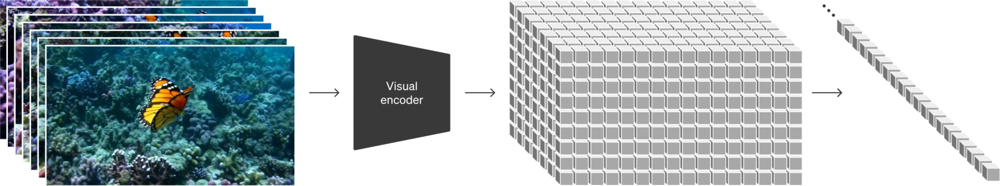

# 09 · Sora-Style 视频生成架构

> 这一页讨论 spacetime patch、video VAE/decompressor，以及可变时长、分辨率和宽高比。Sora 没有开源，但这些设计也能在 CogVideoX、LTX-Video 和 Wan 等视频 DiT 中看到。

## 1. 为什么需要专门的视频架构

逐帧独立生成无法保证时间连贯性，常见问题包括：

- **逐帧独立**：每帧的像素可能颜色跳跃、边缘不连续、物体在一帧内出现在两个位置，造成"闪烁"或"抖动"。
- **时间连贯性**：人类视觉对运动连续性极度敏感。即使每帧单独看"是正确的图"，帧间不一致也会被感知为"坏视频"。
- **效率角度**：逐帧独立生成 \(T\) 帧需要 \(T\) 次完整 forward pass（\(T \times \text{推理时间}\)）。视频 VAE 在 latent 空间压缩时空张量，减少 DiT 需要处理的 token 数。

因此，现代视频生成模型（Sora、CogVideoX、Wan、LTX-Video）都使用**统一的 3D latent 表示**和**视频 DiT**，一次性处理整个时空体积。

## 2. Spacetime Patch - 视频的 Token 化

### 2.1 从图像 Patch 到 Spacetime Patch

图像 DiT 的 patchify 只处理 2D 空间：把 `(C, H, W)` 的 latent 切成 \((H/p) \times (W/p)\) 个 patch，每个 patch 是 \(C \times p \times p\) 的一维向量。

视频 DiT 的 spacetime patchify 处理 3D 体积：把 (C, T, H, W) 的 latent 切成 **时间维也参与的 3D patch**：

<figure style="margin: 1rem 0 1.5rem;">
  
  <figcaption style="margin-top: 0.6rem; color: #555; font-size: 0.95rem;">
    来源：OpenAI《Video generation models as world simulators》“Turning visual data into patches”。我已在浏览器中打开原图后截图保存。图里把原始视觉输入、压缩后的 latent 体和最终 patch token 序列的关系直接画了出来。
  </figcaption>
</figure>

```python
# 图像 DiT patchify
image_latent: (B, C, H, W) = (1, 4, 64, 64)
patch_size = (2, 2)  # 纯空间
tokens: (B, 32*32, embedding_dim) = (1, 1024, d)

# 视频 DiT spacetime patchify
video_latent: (B, C, T, H, W) = (1, 16, 16, 32, 32)  # 8× 空间压缩, 4× 时间压缩
patch_size = (1, 2, 2)  # 时间不切(patch_t=1), 空间 2×2
tokens: (B, 16*16*16, embedding_dim) = (1, 4096, d)
                                     # T/1  H/2  W/2
```

### 2.2 不同模型的 Patch 选择

| 模型 | Patch Size (T, H, W) | 说明 |
|------|---------------------|------|
| CogVideoX-2B | (1, 2, 2) | 时间不切，空间 2×2。每帧独立 patchify 后堆叠。 |
| LTX-Video 2B | (1, 2, 2) | 同上。时间维度的交互通过 attention 而非 patch 完成。 |
| Wan2.1-1.3B | (1, 2, 2) | 同上。 |
| Sora (推测) | (1, p, p) 或可变 | Sora 支持 variable resolution，patch 大小可能根据输入动态调整。 |

**为什么通常 patch_t = 1？** 视频 VAE 已经做了 4× 时间压缩（16 帧 → 4 帧 latent），每个 latent 帧已经涵盖了 4 帧原始像素的时空信息。在 DiT 层面再切时间维会让 token 数太少，丢失运动细节。

## 3. Video VAE - 从像素到 Latent 的 3D 压缩

### 3.1 对比 Image VAE 和 Video VAE

| 维度 | Image VAE | Video VAE |
|------|-----------|-----------|
| 输入 | (B, 3, H, W) | (B, 3, T, H, W) 或 (B, T, 3, H, W) |
| 空间压缩 | 8×（H→H/8, W→W/8） | 8×（同上） |
| 时间压缩 | 无 | 4×（T→T/4，部分模型 2× 或 1×） |
| 卷积类型 | 2D Conv（独立处理每通道） | 3D Conv（时间+空间联合卷积）或 2D+1D 混合 |
| Decoder 输出 | 单张图 | 全部帧（一次 decode，帧间自然连贯） |
| 典型压缩比 | \((8 \times 8 \times 3) / 16 = 12:1\) | \((8 \times 8 \times 4 \times 3) / 16 = 48:1\)（含时间） |

### 3.2 各模型 VAE 规格

| 模型 | 空间压缩 | 时间压缩 | Latent 通道数 | 编码速度 |
|------|---------|---------|--------------|---------|
| CogVideoX-2B | 8× | 4× | 16 | 中等 |
| LTX-Video 2B | 8× | 1×（无压缩） | 128 | 快（无时间压缩，latent 大但直接） |
| Wan2.1-1.3B | 8× | 4× | 16 | 中等 |

> **LTX-Video 的时间轴**：LTX-Video 不做时间压缩（vae_temporal_compress=1），latent 的 T 维等于原始帧数（如 16 帧 → 16 帧 latent）。这避免了 3D VAE 的时间压缩开销，但 latent 体积和 DiT token 数都增加 4×。2B distilled 模型用更快的 forward 抵消这部分代价。

## 4. Variable Duration / Resolution / Aspect Ratio

Sora 技术报告提出让**视频模型原生支持不同时长、分辨率和宽高比的输入**，训练时不把这些参数固定为单一规格。实现依赖两个设计：

1. **No Position Encoding Cutoff**：使用在训练中见过的最大 token 数作为上限，推理时接受任意 \(\le\) 该上限的 token 数。不预设固定的 \(T\) 或 \(H \times W\)。
2. **Patchify 的灵活性**：无论输入是 240p×3s 还是 1080p×1min，patchify 后都是统一的 token 序列，DiT 只关心 token 的数量和 embedding，不关心它们是"多少帧"还是"多高分辨率"。

在开源实现中，这一特性并未完全兑现（训练固定分辨率/帧数），但**推理时可以通过调整 num_frames 和 resolution 来修改输出**，这正是 T15 实验的基础：用小规格（16f×256²）在中等显存配置上跑通，大规格需要更大 GPU。

## 5. Video DiT 与 Image DiT 的结构差异

| 维度 | Image DiT | Video DiT |
|------|----------|-----------|
| 输入 latent | (B, C, H, W) 4D | (B, C, T, H, W) 5D |
| Patchify | 2D（空间切→序列化） | 3D（spacetime 切→序列化，常见 patch_t=1） |
| Attention | Spatial self-attention（所有 token 互相看） | Spatial + Temporal attention（分离或 joint） |
| 位置编码 | 2D sin-cos / RoPE | 2D spatial + 1D temporal（或 3D RoPE） |
| Causal Mask | 无（bidirectional） | 可选：temporal causal（CogVideoX）或 bidirectional（LTX-Video） |
| CFG | 需要（conditional vs unconditional） | 同左 |
| 显存瓶颈 | Attention \(N^2\)（\(N \propto HW\)） | Attention \((T \times N_{\mathrm{spatial}})^2\)（\(N_{\mathrm{tokens}} \propto T \times HW\)），多 \(T\) 倍放大 |

### 5.1 Temporal Attention 的两种设计

1. **分离式 Spatial + Temporal**（CogVideoX 风格）：每个 DiT block 依次执行 spatial self-attention（同一帧内所有空间 token 互相看）和 temporal self-attention（同一空间位置的所有时间帧互相看）。空间 attention 只处理单帧 token，时间 attention 的 N 也较小，但每个 block 需要两次 attention 计算。
2. **Joint Spacetime Attention**（LTX-Video 风格）：所有 \(T \times S\) 个 token 进入一个统一的 full attention。简单但 \(O(N^2)\) 大（\(N = T \times S\)），需要 flash-attention 或 distilled 模型来弥补。

> **结论**：视频模型在图像 DiT 之外增加三类结构：**(1) spacetime patch** 将 3D latent 统一 token 化；**(2) 视频 VAE** 同时压缩空间和时间；**(3) temporal attention** 建模帧间运动。Sora（未开源）提出了这套表示方法，CogVideoX、LTX-Video、Wan 等开源模型给出了不同实现。在受限显存配置下，需要把分辨率控制在 \(\le 256\mathrm{p}\)、帧数控制在 \(\le 16\)、步数控制在 \(\le 8\) steps distilled。

## 6. 和我的 diffusion_engine 的关系

> **和我的 diffusion_engine 的关系**：本页描述的视频架构对 diffusion_engine 有以下影响：

| 视频概念 | diffusion_engine 影响 |
|---------|---------------------|
| Spacetime patchify | `core/dit.py` 的 patchify 目前仅支持 2D（图像）。扩展为 3D（spacetime patch）需要增加 patch_t 参数和 3D conv。 |
| 视频 VAE | `core/vae_stub.py` 的 ToyVAE 仅支持 2D 编码/解码。视频 VAE 需添加 3D conv 或 2D+1D 混合层。 |
| Temporal attention | `core/attention.py` 的 SelfAttention 是 2D 的。视频需要额外增加 `TemporalAttention` 模块（沿 T 维做 attention）。 |
| Latent shape | `core/pipeline.py` 需要在入口处理 5D latent `(B,C,T,H,W)`，并在 shape 注释中区分图像和视频路径。 |
| Memory 估算 | `core/memory_manager.py` 的 buffer 分配需考虑 T 维度的放大效应（latent buffer × T 倍）。 |

**当前状态**：diffusion_engine 是 image-only 的 toy 实现。视频 DiT 需要增加 TemporalAttention、spacetime patchify 和 3D VAE；这些不在当前交付范围内（TinyDiT 目标仅覆盖图像），本页的 shape 约定可供后续扩展使用。

**T15/T18 备注**：T15 的视频 reference inference 使用 diffusers 的完整 pipeline（不经过 diffusion_engine），所以 diffusion_engine 不需要修改。T18 最终报告需标注"diffusion_engine 为 image-only，视频需独立扩展"。

## 7. 延伸阅读

- **Sora Technical Report**：OpenAI 发布的视频生成技术报告，提出了 spacetime patch 和 variable duration/resolution 的概念框架。
- **CogVideoX 论文**：开源实现，分离式 spatial + temporal attention + causal mask，16ch latent VAE。
- **LTX-Video 论文**：2B distilled real-time DiT，128ch latent（无时间 VAE 压缩）+ joint spacetime attention。
- **学习笔记**：`learning/notes/09_视频latent和spacetime_patch.md` - 视频 latent shape 的 (B,C,T,H,W) vs (B,T,C,H,W) 约定与 受限显存策略。
