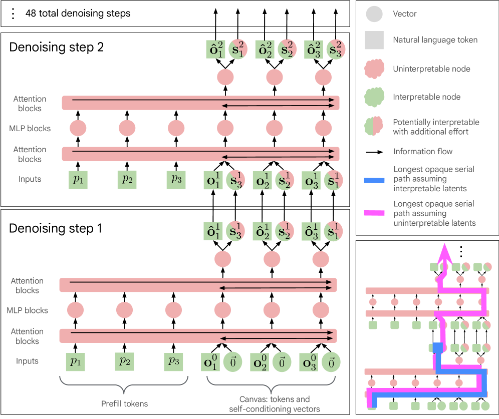
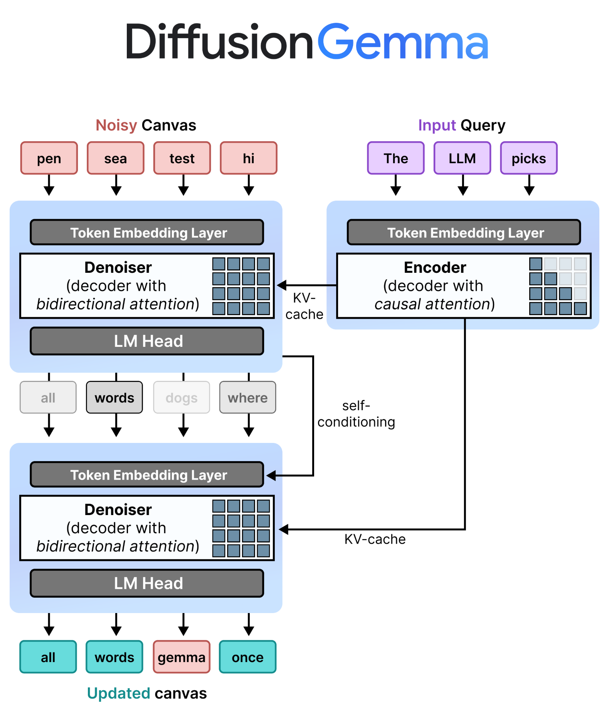

# 12 · DiffusionGemma 架构与推理

DiffusionGemma 是 Google DeepMind 开源的离散扩散文本模型。它保留 Gemma 系列的语言主干，但把生成方式从逐 token 自回归改成了 256-token canvas 上的多步去噪。本章重点看三个问题：KV cache 还在不在，attention mask 到底是 causal 还是 full matrix，以及 256-token block 如何接成长文本。

---

## 1. 自回归的瓶颈与扩散的计算绑定

### 自回归大型语言模型（AR LLM）的显存带宽问题
传统自回归语言模型一次只生成一个 Token。Batch size 很小时，每一步都要从 HBM/VRAM 读一遍大块模型权重，却只对一个位置做计算，GPU 很容易卡在显存带宽上。
* **算术强度低**：一次前向传播只服务当前 Token，读权重的成本很高，实际矩阵乘法很少。
* **计算单元吃不满**：显存读取速度低于 Tensor Cores 的计算上限，单用户推理时等待数据的时间占比很高。
* **延迟很难摊薄**：batching 可以提高吞吐，但单个用户仍要等 token 一个个出来。

### DiffusionGemma 的计算绑定（Compute-Bound）设计
DiffusionGemma 一次处理一个固定长度的 canvas，默认是 256 个 Token。它不会在一次 forward 后就确定全部输出，而是在这个 canvas 上反复 denoise。
* **并行位置更多**：同一次前向传播处理 256 个位置，权重读取可以被更多计算摊薄。
* **瓶颈更接近计算侧**：模型把单用户生成从“每步只算一个位置”改成“每步修一整块”，更容易用上 GPU 的矩阵计算能力。
* **速度来自 block 内并行**：官方材料给出的 H100 FP8 数字超过 1100 tokens/s，消费级 RTX 5090 也能达到 700 tokens/s 量级。模型仍要多步采样，但每一步会并行处理整块 canvas。

---

## 2. 文本去噪机制的演进

图像扩散可以给像素加高斯噪声。文本不行，Token `"The"` 没有“稍微变模糊”的连续状态，所以离散文本扩散通常会把部分 Token 替换成特殊符号或随机词表 Token。

### 路径 A：掩码扩散（Masked Diffusion）
类似于 BERT 的 Masked Language Modeling (MLM)，该机制在训练时将文本序列中的部分 Token 替换为特殊的 `[MASK]` 标记：
* **前向过程**：根据时间步逐步增加 `[MASK]` 比例。
* **逆向去噪**：模型预测 `[MASK]` 位置的真实 Token。在每一步中，采样器根据模型预测的置信度，仅保留最确信的部分 Token，替换掉对应的 `[MASK]`，并在下一步继续预测剩余的 `[MASK]`。
* **主要限制**：很多 masked diffusion 采样过程会较早固定一部分位置。如果早期填错，后续步骤未必能把它改回来。

### 路径 B：均匀状态扩散（Uniform State Diffusion，DiffusionGemma 的选择）
DiffusionGemma 使用均匀状态扩散：
* **噪声定义**：此处的“噪声”不再是唯一的 `[MASK]` 标记，而是**从词表中随机、均匀抽样的任意破坏性 Token**。
* **前向过程**：在训练时，输入文本中的部分 Token 会被随机替换成词表中的乱码 Token，比例随着扩散时间步变化。
* **逆向去噪与自纠错**：
  * 在每个去噪步，模型会对画布（Canvas）中**所有位置**的 Token 进行重新预测并输出概率分布。
  * 如果模型对当前位置的预测置信度较高，且满足采样器阈值，则将该位置替换为新预测的 Token。
  * 如果某些位置的预测概率低，采样器会把它们重新加噪（re-noising），也就是再次用随机 Token 覆盖。
  * **自纠错点**：早期填进去的坏 Token 不一定被锁死。周围上下文变稳定后，如果模型对它的置信度下降，后续步骤可以把它当噪声重写。

| 特性维度 | 掩码扩散 (Masked Diffusion) | 均匀状态扩散 (Uniform State Diffusion) | 自回归生成 (Autoregressive) |
| :--- | :--- | :--- | :--- |
| **噪声表现** | 显式 `[MASK]` 标记 | 隐式均匀随机 Token 替换 | 无扩散噪声 |
| **去噪动作** | 逐级填充 `[MASK]` 空间 | 预测全画布，不满足阈值处重填随机噪声 | 逐个 Token 尾部追加 |
| **自纠错能力** | 已固定位置较难回改 | 允许继续修改低置信度位置 | 无法回溯已输出 Token |
| **生成步数** | 取决于采样策略（通常 20-50 步） | 固定或自适应步数（如 48 步） | 与生成文本长度 `N` 严格一致 |

---

## 3. 网络架构：Encoder-Denoiser 动态模式切换

<figure style="margin: 1rem 0 1.5rem;">
  
  <figcaption style="margin-top: 0.6rem; color: #555; font-size: 0.95rem;">
    来源：arXiv 技术报告《How Transparent is DiffusionGemma?》Figure 1。图中每轮去噪之间传递 canvas token \(o^t\) 和 self-conditioning 向量 \(S^t\)，prompt 侧 KV 在整个循环中保持静态。
  </figcaption>
</figure>

这张 technical report 图把数据流拆成三部分：**prefill prompt**、**当前 canvas**、**跨 step 传递的 self-conditioning**。工程上最值得看的是这里：Gemma 主干没有被整套推倒重做，改动集中在输入组织、attention mask、KV cache 写入时机和 denoising loop。

<figure style="margin: 1rem 0 1.5rem;">
  
  <figcaption style="margin-top: 0.6rem; color: #555; font-size: 0.95rem;">
    来源：Google Developers Blog《DiffusionGemma: The Developer Guide》中的 `diffusion_architecture` 图。图里可以直接看到 input query 走 causal encoder，noisy canvas 走 bidirectional denoiser，KV cache 复用，self-conditioning 回到下一步输入。
  </figcaption>
</figure>

DiffusionGemma 复用了 **Gemma 4 26B A4B** checkpoint 的语言主干。公开材料描述的模型是 MoE 架构，30 层，词表约 262K，单 Token 激活约 3.8B 参数和 8 个专家。新增部分主要是 encoder-denoiser 模式切换、self-conditioning 和扩散采样器。

```
                    ┌────────────────────────┐
                    │  Prompt: "Write a..."  │
                    └───────────┬────────────┘
                                │
                         (Encoder Mode)
                       Causal Attention
                                │
                                ▼
                       ┌────────────────┐
                       │  Static KV     │ (Stored in Memory)
                       │  Cache         │
                       └────────│───────┘
                                │
                     (Cross-Attention Guidance)
                                │
    ┌───────────────────────────┼───────────────────────────┐
    │ Denoiser Loop (48 steps)  ▼                           │
    │                                                       │
    │  [Random Canvas]  ──►  (Denoiser Mode)  ──► [Denoised │
    │    (256 tokens)      Bidirectional Attention  Canvas] │
    │                                                       │
    │         ▲                                             │
    │         └─────────── Self-Conditioning ───────────────┘
    └───────────────────────────────────────────────────────┘
```

### A. 编码器模式（Encoder Mode）
* **职责**：处理 prompt，以及已经 commit 的输出 block。
* **机制**：这一路使用因果自注意力（causal self-attention），每个 Token 只能看见自己左侧的上下文。
* **输出**：prompt 或已完成 block 经过 prefill 后写入 KV cache。当前 canvas 去噪时会读取这份 KV，但不会改写它。

### B. 去噪器模式（Denoiser Mode）
* **职责**：接收一个 256-token noisy canvas，结合 encoder 写好的 KV cache 做多步去噪。
* **机制**：canvas 内使用双向注意力（bidirectional self-attention）。这部分不是左到右，256 个位置在同一步里互相可见。
* **上下文读取**：canvas 位置可以读取 prompt 和已 commit block 的 KV cache。反过来，未 commit 的 canvas 不会写回上下文 KV。

### C. 自我调节与历史记忆（Self-Conditioning）
去噪器通过 self-conditioning 传递上一轮 canvas 状态：
1. 在第 \(t\) 步，去噪器输出全画布每个位置的 Logits。
2. 这些 Logits 经过 Softmax 转化为概率分布。
3. 概率分布与模型的**词嵌入表（Embedding Matrix）**相乘，为画布每个位置生成一个加权的融合特征向量（融合特征包含了上一步预测的概率分布信息）。
4. 该融合特征向量通过一个轻量级的前馈网络（FFNN）进行映射，并直接**加到第 \(t+1\) 步的输入 Token Embedding 中**。
5. 下一步看到的是“当前 token embedding + 上一步预测分布的投影”。这就是 denoising step 之间传递的主要状态。

### D. KV cache 和 attention mask 怎么分工

DiffusionGemma 仍然有 KV cache，但它的写入时机和普通 AR LLM 不一样：

```text
prompt / 已完成输出 block
  -> causal encoder prefill
  -> 写入 KV cache

当前 256-token canvas
  -> bidirectional denoiser 多步去噪
  -> 未完成前不追加 KV cache

canvas 收敛或达到步数上限
  -> commit 成 finalized block
  -> 再用 causal encoder 路径写入 KV cache
  -> 开下一个 256-token canvas
```

“输出的 KV cache”来自 Gemma backbone 在 causal encoder/prefill 模式下对 finalized output block 的重新编码，并非直接复用 denoiser 最后一轮 hidden states。

attention mask 也要分阶段看：

```text
已确定上下文: causal attention
当前 canvas: full matrix / bidirectional attention
canvas 读上下文: 读取 prompt 和已完成 block 的 KV cache
block 之间: autoregressive
```

如果某个 token 48 steps 后仍然不稳定，系统并没有理论保证一定修好。工程上只能接受当前 block、增加 denoising steps、调低温度、改 entropy bound，或者重采样。DiffusionGemma 的速度和质量来自训练好的 denoiser 在常见文本分布上的收敛能力，不是来自“48 步必然正确”的数学保证。

### E. 如果我已经有一个大语言模型，怎么改造成 diffusion text？

短答案：backbone 尽量保留，生成范式要改。以标准 decoder-only LLM 为例，backbone 通常包括：

* **词嵌入 / 输出头**：`embed_tokens`、`lm_head`。
* **位置编码**：RoPE、位置索引逻辑。
* **Transformer block 主干**：attention、MLP/FFN、MoE、残差、RMSNorm。
* **多模态前端**（如果原模型本来就有）：vision encoder / projector / image token 接口。

DiffusionGemma 保留 Gemma 主干，并增加一条离散扩散推理路径。实现至少涉及这些改动：

1. **把单 token decode 改成固定长度 canvas**：不再输入“上一步生成的 1 个 token”，而是输入长度为 \(C=256\) 的 noisy canvas。
2. **给 denoiser 路径打开双向可见**：AR LLM 的约束是 strictly causal；text diffusion 需要 canvas 内所有位置互相看。
3. **把 prompt 路径和 canvas 路径拆开**：prompt 先走一次 prefill，形成静态 KV；之后每个 diffusion step 都拿 canvas 去读取这份上下文，而不是重新做整段 AR decode。
4. **加入 self-conditioning 通道**：上一轮 logits 不能直接丢掉，要经过 softmax 和 embedding table 回投成 \(S^t\)，再并回下一步输入。
5. **把训练目标从 next-token prediction 改成 denoising**：AR 是“预测下一个 token”；diffusion text 是“给你一段被破坏的 canvas，恢复真实 token 分布”。这会连带改掉数据构造、loss 定义、采样器。
6. **加入 diffusion sampler / scheduler**：推理不再是 greedy/sample 一次结束，而是 \(T\) 轮“前向 + 采样 + renoise + early stop”循环。

### F. 哪些地方是“主干基本不动”，哪些地方是“必须大改”

| 模块 | 是否保留 LLM backbone | 要改什么 |
| :--- | :--- | :--- |
| Embedding / lm_head | 大体保留 | 继续复用词表与 embedding 空间，但要支持 canvas token 和 self-conditioning 回投。 |
| FFN / MoE / Norm | 基本保留 | 这些是语言能力主干，通常不想动；DiffusionGemma 正是复用了 Gemma 4 的 MoE 主体。 |
| Attention | 结构可复用，行为要改 | 必须支持从 causal 到 bidirectional 的切换，并让 canvas 在每一步读取 prompt 侧上下文。 |
| KV cache | 写入时机变化最大 | AR 里 KV 随 token 逐步追加；这里 prompt 和已 commit block 写 KV，当前 canvas 的 step-to-step 状态主要是 \(o^t\) 和 \(S^t\)。 |
| Forward API | 必须改 | 输入不再只是 `input_ids`，而是 prompt context + noisy canvas + diffusion step + optional self-conditioning。 |
| Generate loop | 必须重写 | 从单步 token sampling 改成多步 denoising loop，再加 multi-canvas 外循环。 |

> **生成路径的改动**
> DiffusionGemma 保留 Gemma/MoE 主干，并把生成路径改为去噪：当前 block 读取上下文 KV，并行修正 256 个位置，再用 self-conditioning 跨 step 传递状态。主要改动落在 attention mask、KV 写入时机、训练目标和采样循环，FFN 变化相对较小。

---

## 4. 分块自回归扩散（Block Autoregressive Diffusion）

去噪器一次只处理一个 256-token canvas。长文本靠多画布采样：block 内扩散，block 之间自回归。

```python
# 数据流概念伪代码
prompt = "Please write a long sci-fi story..."
kv_cache = encoder.prefill(prompt)  # 首次 Prefill 生成初始 KV Cache

while not generate_finished:
    # 1. 初始化 256 长度的随机画布
    canvas = initialize_random_tokens(length=256)

    # 2. 逆向迭代去噪循环 (例如 48 步)
    for step in range(num_denoising_steps):
        # 融合上一步的概率分布特征
        conditioned_embeddings = embed(canvas) + self_conditioning(prev_probs)

        # 去噪器进行双向 All-to-All 注意力计算，并 cross-attend 到只读的 kv_cache
        logits = denoiser.forward(conditioned_embeddings, kv_cache)

        # 采样器决定保留哪些 token，重新对低置信度位置进行 noise 覆盖
        canvas, prev_probs = sampler.step(logits, canvas)

        if adaptive_stopping.should_stop():
            break

    # 3. 256 Canvas 去噪完成，识别到结束符或填满
    finalized_block = canvas

    # 4. 自回归扩展：将 finalized_block 视为 prompt 的延续，送入 Encoder
    # 追加并更新静态 KV Cache 缓存。之后该 KV Cache 作为下一画布的上下文。
    kv_cache = encoder.incremental_prefill(finalized_block, kv_cache)

    if eos_token in finalized_block:
        generate_finished = True
```

这就是 block-autoregressive diffusion：一个 block 内用 full attention 反复修，block 完成后再进入 causal KV，作为下一个 block 的上下文。

---

## 5. 采样器与调度器参数

DiffusionGemma 的采样质量主要受 sampler 和 scheduler 控制。公开示例里常见的配置如下。

### A. 温度调度器（Logits Temp Scheduler）
为了平衡去噪早期探索和后期收敛，Logits 会被除以一个动态温度 \(T\)。
* 在 48 步去噪过程中，温度 \(T\) 采用线性衰减，由 **0.8** 逐渐降低至 **0.4**。
* **直觉**：早期噪声多，较高温度让模型探索更多候选；后期上下文更清楚，较低温度让分布收紧。

### B. 熵界采样器（Entropy-Bounded Sampler）
用于精确控制去噪每一步中保留哪些 Token、丢弃哪些 Token。
1. **熵值计算**：计算画布上每个位置的预测概率分布的香农熵（Entropy）。熵越低，代表模型对该位置的预测越自信（如 99% 的概率是 `"LLM"`，熵接近 0）。
2. **排序过滤**：将画布的 256 个位置按熵值**从低到高（从最自信到最不自信）进行排序**。
3. **阈值累加**：从最自信的 Token 开始累加。当累加的互信息上限（Mutual Information Bound）超过设定的熵界（\(\text{Entropy Bound} = 0.1\)）时，停止接纳。
4. **再噪声化**：所有被接纳的 Token 保持预测值，未被接纳的 Token 判定为噪声，用新的随机 Token 重新覆盖。

### C. 自适应早停机制（Adaptive Stopping）
不一定要跑满 48 步。如果 canvas 提前稳定，可以早停：
* **置信度达标**：全画布所有 Token 的平均熵低于 **0.005**。
* **预测稳定**：最高概率的 Token 预测结果连续 **2** 步不变。

---

## 6. 案例分析：Sudoku Solver（数独求解器）

为什么 Diffusion 架构适合解决强约束的多变量协同任务（如数独）？

```
  自回归模型 (AR) 顺序预测：                   DiffusionGemma 并行协同去噪：
  ┌───┬───┬───┐                               ┌───┬───┬───┐
  │ 5 │ 3 │ ? ├──► 必须立刻决定第三格         │ 5 │ 3 │ 4 │  所有格点在 All-to-All
  └───┴───┴───┘    无法考虑未来冲突           ├───┼───┼───┤  注意力下同时互相制约，┌───┬───┬───┐                               │ 6 │ ? │ 8 │  若后期发现冲突，可通过
  │ 6 │ ? │ 8 │    一旦写错，无法修改         ├───┼───┼───┤  Re-noising 机制在后续去噪
  └───┴───┴───┘                               │ ? │ 9 │ ? │  步中将错误擦除并重写。
                                              └───┴───┴───┘
```

* **自回归的痛点**：数独需要同时满足行、列和九宫格约束。自回归模型从左到右硬写答案，写到第 80 格才发现和第 1 格冲突时，已经很难回改。
* **DiffusionGemma 的解法**：
  * **全局上下文感知**：Denoiser 采用双向注意力，首尾 Token 互相可见，一次前向传播能同时看多个格点约束。
  * **容错与自我修正**：如果第 10 步填入的数字在第 20 步被判定大概率冲突，它的置信度（熵）会变差，并在下一步中被重置为噪声数字重新求解。
* **微调效果**：DiffusionGemma 26B 基础模型在数独任务上的正确率约为 0%。使用 Google DeepMind 开源的 **Hackable Diffusion** JAX SFT 配方训练后，数独求解成功率可到约 80%，所需步数也更少。

---

## 7. 推理与部署管线

### vLLM 部署标准命令
vLLM 已集成 DiffusionGemma。下面是 OpenAI 兼容 server 的启动示例：

```bash
vllm serve google/diffusiongemma-26B-A4B-it \
  --max-model-len 262144 \
  --max-num-seqs 4 \
  --gpu-memory-utilization 0.85 \
  --attention-backend TRITON_ATTN \
  --generation-config vllm \
  --hf-overrides '{"diffusion_sampler": "entropy_bound", "diffusion_entropy_bound": 0.1}' \
  --diffusion-config '{"canvas_length": 256}' \
  --enable-chunked-prefill
```

### Hugging Face Transformers 推理代码
开发者可以使用标准 `transformers` 库中的 `DiffusionGemmaForBlockDiffusion` 进行推理：

```python
from transformers import DiffusionGemmaForBlockDiffusion, AutoProcessor
import torch

MODEL_ID = "google/diffusiongemma-26B-A4B-it"

# 1. 初始化处理器与离散扩散专用模型类
processor = AutoProcessor.from_pretrained(MODEL_ID)
model = DiffusionGemmaForBlockDiffusion.from_pretrained(
    MODEL_ID,
    torch_dtype=torch.bfloat16,
    device_map="auto",
)

# 2. 准备对话模版
messages = [
    {"role": "user", "content": "Explain the core difference between AR and Diffusion LLMs."}
]

input_ids = processor.apply_chat_template(
    messages,
    tokenize=True,
    add_generation_prompt=True,
    return_dict=True,
    return_tensors="pt"
).to(model.device)

# 3. 运行多画布扩散采样推理
output = model.generate(**input_ids, max_new_tokens=512)

# 4. 打印解码文本
text = processor.decode(output[0], skip_special_tokens=False)
print(text)
```

---

## 8. 与 diffusion_engine 的概念映射

本项目的 `diffusion_engine` 是玩具级实现，但有几处概念可以对上 DiffusionGemma：

* **双向注意力与因果注意力的切换**：`diffusion_engine/core/attention.py` 里的 causal mask 开关，对应 DiffusionGemma 的 encoder/denoiser attention 切换。
* **Prompt cache 与管线控制**：`diffusion_engine/core/text_conditioning.py` 只在首次 encode 时运行 text encoder，后续循环复用 embedding。DiffusionGemma 用的是 KV cache，但“上下文只读复用”的思路相近。
* **Scheduler 控制**：`diffusion_engine/core/scheduler.py` 的 Euler 降噪路径和 DiffusionGemma 的温度调度不等价，但它们都用时间步控制逐步逼近。

---

## 9. 参考资源与链接

本章参考了这些资料：
1. **技术报告（架构图与 step-to-step 信息瓶颈）**：[How Transparent is DiffusionGemma?](https://arxiv.org/html/2606.20560v1)
2. **Google 官方开发者指南**：[DiffusionGemma: The Developer Guide](https://developers.googleblog.com/en/diffusiongemma-the-developer-guide/)
3. **可视化原理解析**：[A Visual Guide to DiffusionGemma](https://newsletter.maartengrootendorst.com/p/a-visual-guide-to-diffusiongemma)
4. **Hugging Face 模型卡片**：[google/diffusiongemma-26B-A4B-it](https://huggingface.co/google/diffusiongemma-26B-A4B-it)
