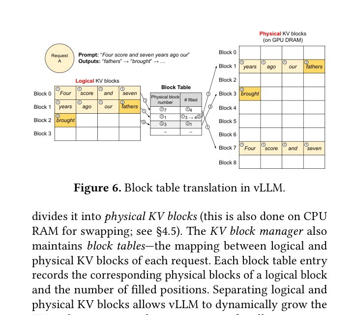

# 02 · Paged Attention 基础 - 原理与实现进度

这里说明 paged attention 的工作方式，并记录 minivLLM 的实现进度。审计日期：2026-06-07。结论来自对 `multimodal/minivLLM/` 的静态分析。

## 1. 什么是 Paged Attention？

Paged attention 借鉴了操作系统虚拟内存的页表（page table）思想，将 KV cache 切分为固定大小的"页"（blocks）。它可以解决 contiguous KV cache 的三大问题：

### 问题一：内存碎片

传统 contiguous buffer 为每个序列预分配 `max_seq_len` 的连续空间。不同序列长度差异大时，短序列浪费容量，长序列可能需要动态移动数据。

### 问题二：动态增长

序列从 100 token 增长到 200 token 时，contiguous buffer 可能需要将全部数据复制到新位置。Paged attention 只需分配新 block，block table 追加一个新条目即可。

### 问题三：内存共享

多个请求往往共享相同的 prefix（如 system prompt）。Paged attention 允许多个 block table 指向相同的物理 block，避免重复存储，这就是 **prefix caching**。

## 2. Paged Attention 的工作原理

<figure style="margin: 1rem 0 1.5rem;">
  
  <figcaption style="margin-top: 0.6rem; color: #555; font-size: 0.95rem;">
    来源：vLLM PagedAttention 论文 Figure 6。图中把逻辑 KV blocks、block table 和物理 KV blocks 的映射关系画得比简化 ASCII 更接近真实实现。
  </figcaption>
</figure>

```
逻辑序列 (token 0..23)
├─ token  0..15 → \(\mathrm{block}_{0}\)  (物理 block 7)
├─ token 16..23 → \(\mathrm{block}_{1}\)  (物理 block 3, 仅使用前 8 个 slot)

Block Table [序列 → 物理 block 映射]
 序列 A: [7, 3]           (2 个 block, 24 token)
 序列 B: [7, 9]           (与 A 共享 block 7 = prefix caching)

物理 Block 池
 \(\mathrm{block}_{0}\): [\(\mathrm{layer}_{0}\) K/V, \(\mathrm{layer}_{1}\) K/V, ... \(\mathrm{layer}_{27}\) K/V]
 \(\mathrm{block}_{1}\): [\(\mathrm{layer}_{0}\) K/V, \(\mathrm{layer}_{1}\) K/V, ... \(\mathrm{layer}_{27}\) K/V]
 ...

Attention 计算（简化版）
 对于 token q = position 23:
   1. 查 block table: 序列 A 使用 block [7, 3]
   2. block 7: 取 token 0..15 的 K/V，计算 Q × K^T
   3. block 3: 取 token 16..23 的 K/V，计算 Q × K^T
   4. 两个 block 的结果拼接 + causal mask
   5. Softmax × V
```

## 3. minivLLM 中的 Paged Attention 实现进度

> **结论：未实现 paged attention**。minivLLM 当前使用的是 **contiguous buffer**，不是 paged attention。`KVCache` 的形状为 `(num_layers, max_seq_len, num_kv_heads, head_dim)`，是连续的一维分配，无 block table 间接寻址。

### 3.1 A/B/C/D 四部分检查

#### A - 通用实现模式 `[已理解]`

Paged attention 需要五个组件：Block 分配器、Block Table、Slot Mapping、Paged Attention Kernel 和调度器集成。vLLM 的 PagedAttention v1/v2 实现可作为参考。

#### B - minivLLM 现有脚手架 `[部分存在]`

- 有：`Context.block_tables` 字段已定义（`utils/context.py` 行 14）
- 有：`Context.slot_mapping` 字段已定义（`utils/context.py` 行 12）
- 有：`Config.kvcache_block_size` 字段已定义（`config.py` 行 12）
- 无：`Context.set_context()` 从未被调用，所有脚手架字段休眠
- 无：`KVCache` 为 contiguous buffer，非 block-based
- 无：Block Manager（无 allocate/free/copy 逻辑）
- 无：Paged Attention Kernel（无 block 级别 attention 计算）

#### C - 改造工作量估计 `[已评估]`

从 contiguous buffer 改为 paged attention 的最小可用实现约 350 行 Python（纯 PyTorch，无 CUDA kernel）：

| 模块 | 预估代码量 | 说明 |
|------|------------|------|
| Block Manager | ~100 行 | 基于 Python list 的 block 分配/释放 |
| Block Table 管理 | ~50 行 | Tensor 形状 [batch_size, max_blocks_per_seq] |
| Paged Attention Matmul | ~50 行 | 逐个 block 做 \(QK^{\mathsf{T}}\)，纯 PyTorch |
| 调度器 | ~150 行 | FIFO scheduler + prefill/decode 切换 |

前提条件：修复 B1（Attn 参数不匹配）和 B2（act_fn=None），将 KV cache 接入 forward。

#### D - vLLM 接口对比 `[已对比]`

minivLLM 的 `Context` 和 `Config` 中的 paged attention 字段与 vLLM 的 `AttentionMetadata` 接口设计一致，说明作者在规划时参考了 vLLM。当前这些字段仅为占位符，无实现。

### 3.2 实现状态总结

| 组件 | 存在 | 状态 |
|------|------|------|
| Block Manager | 无 | 不存在 |
| Block Table（分配逻辑） | 无 | 不存在（字段定义存在但未使用） |
| Slot Mapping | 无 | 不存在（字段定义存在但未使用） |
| Paged Attention Kernel | 无 | 不存在（Attn.forward 为标准 MHA） |
| Scheduler 集成 | 无 | 不存在 |
| KVCache（当前实现） | 有 | Contiguous buffer，未接线 |
| Config 预留字段 | 有 | kvcache_block_size / num_kvcache_blocks |
| Context 预留字段 | 有 | block_tables / slot_mapping / context_lens |

> **注意**：不要把当前的 contiguous KV cache 标为 paged。两者是完全不同的内存管理策略。Contiguous 是静态预分配，Paged 是基于 block table 的动态映射。

## 4. Contiguous vs Paged 对比

| 特性 | Contiguous KV Cache | Paged KV Cache |
|------|---------------------|----------------|
| 分配单位 | Token 级别（位置索引） | Block 级别（block_id 索引） |
| 内存碎片 | 严重（不同序列长度导致外部碎片） | 极少（统一 block 大小，内部碎片可控） |
| 多序列支持 | 困难（需每个序列独立分配连续空间） | 天然支持（block table 映射） |
| 动态增长 | 可能需数据迁移 | 只需分配新 block |
| Prefix Caching | 不支持 | 支持（多序列共享 block） |
| 实现复杂度 | 简单 | 中等（需 block manager + 间接寻址） |
| 内存布局 | `[layer, pos, kv_head, head_dim]` | `[num_blocks, layer, block_size, kv_head, head_dim]` |

## 5. 相关笔记

- [KV Cache 实现审计](../learning/notes/03_kv_cache实现审计.md)
- [Paged Attention 实现进度（含 A/B/C/D 检查项）](../learning/notes/04_paged_attention实现进度.md)
- [已有引擎结构概览](../learning/notes/01_已有引擎结构.md)

## 6. 审计结果文件

- [paged_attention.json](../experiments/text_engine_audit/results/paged_attention.json)
- [kv_cache.json](../experiments/text_engine_audit/results/kv_cache.json)
- [attention.json](../experiments/text_engine_audit/results/attention.json)

---

Atlas Wave 1 - 任务 2 · Paged Attention 基础 · 2026-06-07
