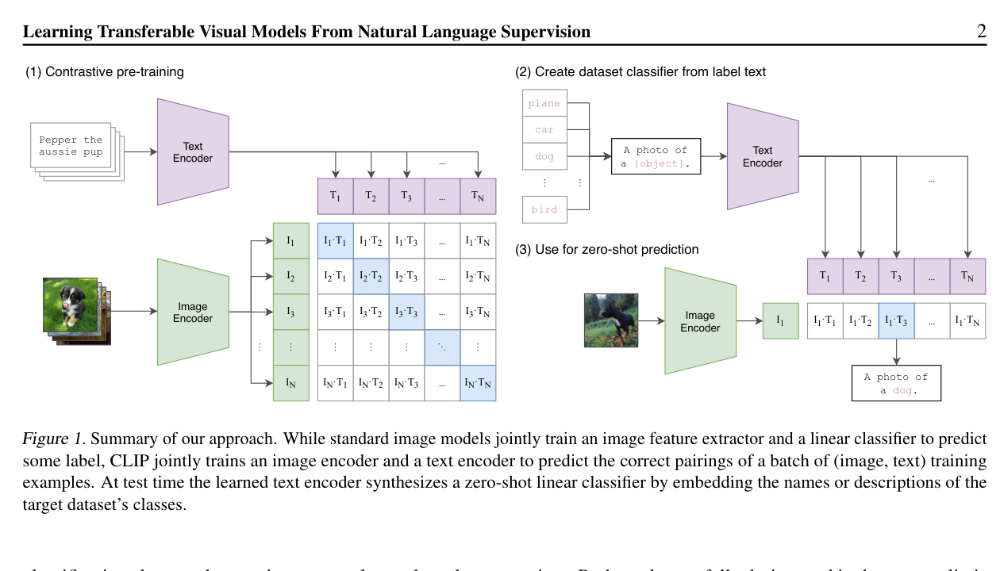

# 04 · CLIP 与图文对齐

CLIP（Contrastive Language-Image Pre-training）是 OpenAI 提出的图文对比学习模型，训练了 4 亿个图文对，学习将图像和文本映射到同一个向量空间。CLIP 的视觉编码器（ViT）是几乎所有现代 VLM 的视觉塔起点，包括 Qwen-VL 系列。

## 1. 双塔架构：图像塔 + 文本塔

CLIP 的核心架构是两个独立的编码器，训练目标是让配对的图文在向量空间中距离最近：

<figure style="margin: 1rem 0 1.5rem;">
  
  <figcaption style="margin-top: 0.6rem; color: #555; font-size: 0.95rem;">
    来源：CLIP 论文 Figure 1。左侧是对比预训练，右侧是零样本分类时如何把标签文本转成 classifier，这比文字更直观地说明了“双塔 + 对比学习”。
  </figcaption>
</figure>

```
图像 → ViT (Image Encoder)  →  image_embedding [batch, dim]
文本 → Transformer (Text Encoder)  →  text_embedding  [batch, dim]

训练目标: image_embedding · text_embedding 最大化（对角线）
          非匹配对的内积最小化

 批量内计算:
   logits = image_emb @ text_emb.T    # [batch, batch]
   labels = [0, 1, 2, ..., batch-1]   # 对角线 = 正样本
   loss = cross_entropy(logits, labels)
```

这个训练方式被称为 **InfoNCE 损失**（或对比损失）。在一个 batch 中，只有对角线上的图文对是正样本，其余都是负样本。模型学会将"一张猫的照片"和"a photo of a cat"映射到相近的向量位置，而将"一张狗的照片"和"a photo of a cat"映射到远离的位置。

## 2. 关键特性：零样本分类

CLIP 最出名的能力是零样本分类。不需要在任何分类数据集上微调，只需要把类别名写成文本 prompt，计算图像与每个 prompt 的余弦相似度，取最高分即可：

```
类别: ["猫", "狗", "鸟", "汽车", "飞机"]
Prompt: ["一张 {类别} 的照片" for 类别 in categories]

image_embedding = CLIP.encode_image(image)
text_embeddings = CLIP.encode_text(prompts)
scores = cosine_sim(image_embedding, text_embeddings)
predicted_class = argmax(scores)
```

这种零样本能力来自训练数据的大规模图文对齐。CLIP 训练了 4 亿个图文对，远远超过传统 ImageNet 的 120 万张标记图片，因此学到了更通用的视觉概念表示。

## 3. CLIP 在 VLM 中的角色

CLIP 的视觉编码器（通常为 ViT-L/14 或 ViT-bigG）被几乎所有主流 VLM 复用，作为视觉塔的初始化权重。Qwen-VL 的视觉编码器就是从 CLIP ViT-bigG 初始化。CLIP 的关键价值在于：

| 作用 | 说明 |
|------|------|
| 视觉概念空间已对齐 | CLIP 的视觉编码器输出的 embedding 已经与文本 embedding 空间对齐（通过对比学习）。这使得后续的 VL Adapter / Projector 只需要少量的学习就能将 visual token 送入 LLM。 |
| 零样本泛化的基础 | CLIP 的对齐给 VLM 提供了零样本理解未见类别的能力，即使 VLM 训练中没有见过某类物体，只要 CLIP 预训练见过，视觉特征就有意义。 |
| 冻结复用 | 大多数 VLM 冻结 CLIP 视觉编码器不训练，只训练 VL Adapter 和/或 LLM。因为 CLIP 的对齐已经足够好，解冻它反而可能导致灾难性遗忘。 |

## 4. 文本塔为什么不用？

VLM 通常只使用 CLIP 的视觉塔（图像编码器），丢弃文本塔。这是因为：

- VLM 使用 LLM（如 Qwen-7B）作为文本理解的核心，LLM 的文本能力远超 CLIP 的小型文本塔。
- CLIP 文本塔的输出维度（通常 512 或 768）与 LLM 的 hidden dimension（如 2560）不匹配，重新投影的意义不大。
- 视觉塔的输出通过 VL Adapter 投影到 LLM 的 embedding 空间后，LLM 可以直接基于自己的上下文理解 visual token，不需要 CLIP 文本塔的中间表示。

## 5. 页面导航

- [← 文档首页](00_index.md)
- [ViT 与图像 Patch 编码](03_vit和图像patch.md)
- [已有引擎审计](01_已有引擎审计.md)
- [Paged Attention 基础](02_paged_attention基础.md)
- [Qwen-VL 多模态输入 →](05_qwen_vl多模态输入.md)
- [多模态 Prefill/Decode](06_多模态prefill_decode.md)
- [多模态 KV Cache 管理](07_多模态kv_cache管理.md)
- [vLLM 多模态推理参考](08_vllm多模态推理参考.md)
- [SGLang 多模态推理参考](09_sglang多模态推理参考.md)

---

minivLLM 多模态推理实验工作区 · Wave 4 / Task 14 · 2026-06-07
